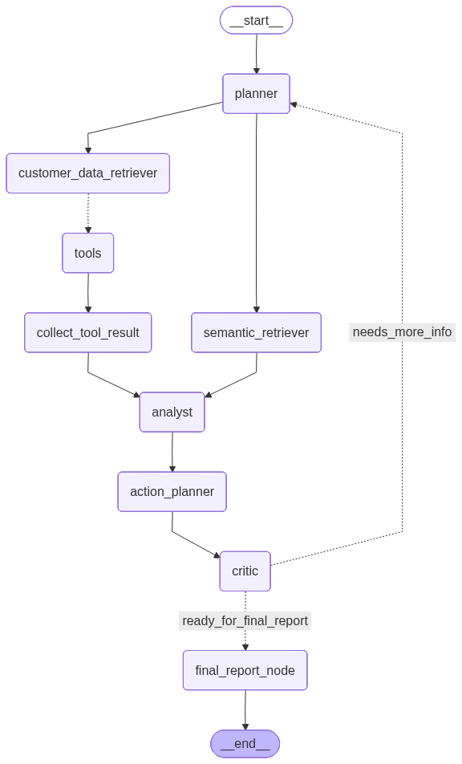

# 🧠 ClientIQ — Agentic Customer Operations Platform

**Ask questions about your clients in plain English. Get deep, evidence-backed intelligence in seconds.**

[](https://python.org)
[](https://langchain-ai.github.io/langgraph/)
[](https://fastapi.tiangolo.com)
[](https://www.postgresql.org)
[](https://streamlit.io)
[](LICENSE)

*A multi-agent AI system that turns natural-language questions into actionable customer insights — powered by LLMs, structured retrieval, and semantic search.*

---

## 📌 Table of Contents

- [Overview](#-overview)
- [Key Features](#-key-features)
- [System Architecture](#-system-architecture)
- [Agent Pipeline](#-agent-pipeline)
- [Tech Stack](#-tech-stack)
- [Project Structure](#-project-structure)
- [Database Schema](#-database-schema)
- [API Endpoints](#-api-endpoints)
- [Getting Started](#-getting-started)
- [Usage Examples](#-usage-examples)
- [Roadmap](#-roadmap)
- [License](#-license)

---

## 🔍 Overview

**ClientIQ** is an **Agentic Customer Operations Platform** designed for B2B companies that manage a portfolio of client accounts. Instead of digging through dashboards, CRMs, or spreadsheets, a support representative can simply ask:

> *"What's going on with Radiant Financial?"*

> *"Which customers are having login problems?"*

ClientIQ orchestrates a team of specialized AI agents that **plan**, **retrieve**, **analyze**, **critique**, and **report** — delivering structured, evidence-based intelligence with full traceability.

---

## ✨ Key Features

| Feature | Description |
|---|---|
| 🤖 **Multi-Agent Orchestration** | 7 specialized agents (Planner, Retriever, Semantic Retriever, Analyst, Action Planner, Critic, Report Generator) working together through a stateful LangGraph pipeline |
| 🔎 **Dual Retrieval Strategy** | Combines structured database queries (exact customer lookups) with semantic vector search (similarity-based ticket discovery via pgvector) |
| 🧩 **Fuzzy Name Resolution** | Users can type approximate company names — RapidFuzz resolves them to exact account IDs |
| 📊 **Structured Analysis** | The Analyst Agent produces typed, Pydantic-validated reports with findings, risks, opportunities, confidence scores, and evidence chains |
| ✅ **Self-Correcting Pipeline** | The Critic Agent independently verifies outputs; if quality is insufficient, it triggers automatic re-planning (up to 2 retries) |
| 🛡️ **Action Safety Model** | Proposed actions carry reversibility tiers and require explicit approval — designed for future human-in-the-loop execution |
| 📡 **REST API + Streaming Chat** | FastAPI backend with RESTful data endpoints + LangServe streaming for real-time agent responses |
| 🗃️ **Rich B2B Data Model** | 14-table relational schema covering accounts, contacts, tickets, subscriptions, invoices, meetings, call transcripts, CSM notes, and more |

---

## 🏗️ System Architecture

```
┌──────────────────────────────────────────────────────────────────────┐
│                        FRONTEND (Streamlit)                         │
│                  Natural language chat interface                     │
└───────────────────────────────┬──────────────────────────────────────┘
                                │
                                ▼
┌──────────────────────────────────────────────────────────────────────┐
│                     BACKEND (FastAPI + LangServe)                    │
│         REST API endpoints  ·  Streaming agent endpoint              │
└───────────────────────────────┬──────────────────────────────────────┘
                                │
                                ▼
┌──────────────────────────────────────────────────────────────────────┐
│                   AGENTIC LAYER (LangGraph StateGraph)               │
│                                                                      │
│   Planner ──► Retriever ──┐                                         │
│       │                   ├──► Analyst ──► Action Planner            │
│       └──► Semantic   ────┘          │                               │
│            Retriever                 ▼                               │
│                              Critic ──► Report Generator             │
│                                │                                     │
│                                └──► (retry → Planner)               │
└───────────────────────────────┬──────────────────────────────────────┘
                                │
                  ┌─────────────┴──────────────┐
                  ▼                            ▼
    ┌──────────────────────┐     ┌──────────────────────────┐
    │   PostgreSQL (SQL)   │     │   pgvector (Embeddings)  │
    │  Accounts, Contacts, │     │  Ticket embeddings via   │
    │  Tickets, Invoices…  │     │  Gemini Embedding Model  │
    └──────────────────────┘     └──────────────────────────┘
```

---

## 🤖 Agent Pipeline

The core of ClientIQ is a **LangGraph StateGraph** that orchestrates 7 agents in a directed workflow:



| Agent | Role | LLM |
|---|---|---|
| **Planner** | Decomposes user query into an execution plan with dependencies | Llama 3.3 70B (Groq) |
| **Customer Data Retriever** | Retrieves structured customer profiles and ticket data via tool calls | Gemini 3 Flash |
| **Semantic Retriever** | Performs dense vector search over ticket embeddings for similarity-based retrieval | Direct pgvector query |
| **Analyst** | Synthesizes retrieved data into structured findings, risks, opportunities, and health assessment | Llama 3.3 70B (Groq) |
| **Action Planner** | Proposes concrete actions (draft emails, update tickets) with confidence scores and reversibility tiers | Llama 3.3 70B (Groq) |
| **Critic** | Independently verifies factual accuracy, action validity, and user intent alignment | Gemini 3 Flash |
| **Report Generator** | Produces the final polished, user-facing response | Llama 3.3 70B (Groq) |

---

## 🛠️ Tech Stack

### AI / ML & Agentic Framework

| Technology | Purpose |
|---|---|
| [LangGraph](https://langchain-ai.github.io/langgraph/) | Multi-agent orchestration with stateful, cyclic graph execution |
| [LangChain](https://www.langchain.com/) | LLM abstraction layer, tool binding, structured output parsing |
| [LangServe](https://github.com/langchain-ai/langserve) | Deploy LangChain/LangGraph runnables as streaming API endpoints |
| [Groq — Llama 3.3 70B](https://groq.com/) | Ultra-fast inference for Planner, Analyst, Action Planner, and Report Generator agents |
| [Google Gemini 3 Flash](https://ai.google.dev/) | LLM for Retriever and Critic agents |
| [Google Gemini Embeddings](https://ai.google.dev/) | `gemini-embedding-2-preview` for generating 1536-dim ticket embeddings |

### Backend & API

| Technology | Purpose |
|---|---|
| [FastAPI](https://fastapi.tiangolo.com/) | High-performance async REST API framework |
| [Pydantic v2](https://docs.pydantic.dev/) | Data validation, settings management, response schemas, and structured LLM output |
| [Uvicorn](https://www.uvicorn.org/) | ASGI server for serving the FastAPI application |

### Database & Storage

| Technology | Purpose |
|---|---|
| [PostgreSQL](https://www.postgresql.org/) | Primary relational database for B2B customer data (14 tables) |
| [pgvector](https://github.com/pgvector/pgvector) | Vector similarity search extension — cosine distance for semantic ticket retrieval |
| [SQLAlchemy 2.0](https://www.sqlalchemy.org/) | ORM with mapped columns, relationship management, and connection pooling |

### Search & Retrieval

| Technology | Purpose |
|---|---|
| [RapidFuzz](https://github.com/rapidfuzz/RapidFuzz) | Fuzzy string matching for resolving approximate company names to exact account IDs |
| Dense Retriever (Custom) | Cosine similarity search over pgvector-stored ticket embeddings |

### Frontend

| Technology | Purpose |
|---|---|
| [Streamlit](https://streamlit.io/) | Rapid prototyping chat interface with real-time streaming agent responses |

### DevOps & Tooling

| Technology | Purpose |
|---|---|
| [uv](https://github.com/astral-sh/uv) | Fast Python package manager and resolver |
| [Pydantic Settings](https://docs.pydantic.dev/latest/concepts/pydantic_settings/) | Environment-based configuration management with `.env` support |
| [python-dotenv](https://github.com/theskumar/python-dotenv) | Environment variable loading from `.env` files |

---

## 📁 Project Structure

```
ClientIQ/
├── agentic/                        # Multi-agent orchestration layer
│   ├── agents/                     # Individual agent implementations
│   │   ├── planner.py              # Task decomposition & execution planning
│   │   ├── retriever.py            # Structured data retrieval via tool calls
│   │   ├── semantic_retriever.py   # Vector similarity search agent
│   │   ├── analyst.py              # Evidence-based analysis & health scoring
│   │   ├── action_planner.py       # Action proposals with safety model
│   │   ├── critic.py               # Independent verification & quality gate
│   │   └── report_gen.py           # Final user-facing report synthesis
│   ├── utils/
│   │   └── helper_fuctions.py      # Tool result collection & routing logic
│   ├── graph.py                    # LangGraph StateGraph definition & compilation
│   ├── agents_state.py             # Typed state schema (AgentState TypedDict)
│   ├── llms_for_agents.py          # LLM configuration per agent
│   └── tools.py                    # LangChain tool definitions
│
├── backend/                        # API & business logic layer
│   ├── api/
│   │   ├── main.py                 # FastAPI app setup, lifespan, route registration
│   │   ├── routes/
│   │   │   ├── data_endpoints.py   # RESTful CRUD endpoints
│   │   │   └── chat_endpoint.py    # Chat endpoint (WIP)
│   │   └── schemas/
│   │       └── endpoints.py        # Pydantic response models
│   └── services.py                 # Core business logic & database queries
│
├── rag/                            # Retrieval-Augmented Generation pipeline
│   ├── data_prep/
│   │   └── get_data.py             # Data extraction for embedding pipeline
│   ├── vector_store/
│   │   ├── embeddings.py           # EmbeddingManager (Gemini Embeddings)
│   │   └── save_embeddings.py      # Batch embedding persistence
│   ├── retrievers/
│   │   └── semantic.py             # Dense retriever (pgvector cosine search)
│   └── save_emb_pipeline.py        # End-to-end embedding generation pipeline
│
├── db_scripts/                     # Database setup & management
│   ├── tables.py                   # SQLAlchemy ORM models (14 tables)
│   ├── db_connect.py               # Engine, session factory, connection pooling
│   └── data_insert.py              # Bulk data ingestion from JSON
│
├── configs/                        # Configuration management
│   ├── config.py                   # Embedding & retriever config
│   └── db_config.py                # Database connection settings (Pydantic Settings)
│
├── frontend/
│   └── app.py                      # Streamlit chat interface
│
├── logger/
│   └── __init__.py                 # Centralized logging with timestamped log files
│
├── tests/
│   └── test_endpoints.py           # API endpoint tests (WIP)
│
├── data/
│   └── b2b_customer_dataset.json   # B2B customer dataset (~16MB)
│
├── graph.png                       # Visual representation of the agent graph
├── langgraph.json                  # LangGraph deployment configuration
├── pyproject.toml                  # Project metadata & dependencies
├── uv.lock                        # Locked dependency versions
└── LICENSE                         # MIT License
```

---

## 🗄️ Database Schema

ClientIQ uses a **14-table relational schema** designed to model the full lifecycle of B2B customer relationships:

| Table | Description |
|---|---|
| `accounts` | Core client company profiles (industry, plan, contract value, status) |
| `contacts` | People at each account (job title, email, decision-maker flag) |
| `tickets` | Support tickets with status, priority, and vector embeddings |
| `ticket_messages` | Individual messages within a ticket thread |
| `subscriptions` | Plan details, contract value, renewal dates |
| `invoices` | Billing records with amounts and due dates |
| `billing_events` | Payment events tied to invoices |
| `usage_events` | Product usage tracking per account |
| `emails` | Email correspondence history |
| `meetings` | Meeting records with notes |
| `call_transcripts` | Call transcript records |
| `csm_notes` | Customer success manager notes |
| `feedback` | Query feedback and recommended actions |
| `outcomes` | Action outcomes and results |

---

## 🌐 API Endpoints

### RESTful Data Endpoints

| Method | Endpoint | Description |
|---|---|---|
| `GET` | `/api/customers/{id}/profile` | Full customer profile with contacts |
| `GET` | `/api/customers/{id}/tickets` | All tickets for a customer |
| `GET` | `/api/customers/{id}/summary` | Health score, risk tier, ticket counts |
| `GET` | `/api/retriever/{query}/semantic` | Semantic ticket search |
| `GET` | `/api/fuzzy_match/{query}` | Fuzzy company name resolution |

### Agent Chat Endpoint

| Method | Endpoint | Description |
|---|---|---|
| `POST` | `/chat_agent/invoke` | Invoke the full agent pipeline |
| `POST` | `/chat_agent/stream` | Stream agent responses in real-time |

---

## 🚀 Getting Started

### Prerequisites

- **Python 3.12+**
- **PostgreSQL** with [pgvector extension](https://github.com/pgvector/pgvector) installed
- **uv** package manager — [install guide](https://github.com/astral-sh/uv)
- API keys for **Groq** and **Google AI**

### Installation

```bash
# Clone the repository
git clone https://github.com/divyansh-iitk/ClientIQ.git
cd ClientIQ

# Install dependencies with uv
uv sync

# Set up environment variables
cp .env.example .env
# Edit .env with your API keys and database credentials
```

### Environment Variables

```env
GROQ_API_KEY=your_groq_api_key
GOOGLE_API_KEY=your_google_api_key
DB_PASSWORD=your_database_password
```

### Database Setup

```bash
# Create tables
uv run python -m db_scripts.tables

# Insert sample data
uv run python -m db_scripts.data_insert

# Generate ticket embeddings
uv run python -m rag.save_emb_pipeline
```

### Run the Application

```bash
# Start the FastAPI backend
uv run uvicorn backend.api.main:app --reload

# In a separate terminal — start the Streamlit frontend
uv run streamlit run frontend/app.py

# Or use LangGraph CLI
uv run langgraph dev
```

---

## 💬 Usage Examples

```
"What's going on with Radiant Financial?"
→ Full account overview with health score, active tickets, risks, and recommendations

"Which customers are having login problems?"
→ Semantic search across all tickets to find login-related issues with affected customer list

"Show me high-priority open tickets for Nexus Corp"
→ Targeted ticket retrieval with severity analysis

"Draft an email to the primary contact at Synergy Solutions about their unresolved billing ticket"
→ Generates a draft email action with approval required (future: HITL execution)
```

---

## 🗺️ Roadmap

> **ClientIQ is an actively evolving project.** The core agentic pipeline and retrieval system are functional. Here's what's coming next:

- [ ] **Human-in-the-Loop Actions** — Execute proposed actions (update ticket status, send emails) with explicit human approval via interactive UI
- [ ] **Expanded Data Ingestion** — Richer datasets covering usage events, billing history, meetings, and call transcripts for deeper insights
- [ ] **Conversation Memory** — Persistent chat history with thread-level context for follow-up queries
- [ ] **Enhanced Frontend** — Production-grade React/Next.js dashboard with real-time agent activity visualization
- [ ] **Authentication & RBAC** — Role-based access control for multi-user team environments
- [ ] **Observability** — LangSmith integration for agent tracing, latency monitoring, and cost tracking
- [ ] **Evaluation Framework** — Automated quality benchmarks for agent outputs across diverse query types
- [ ] **Deployment** — Dockerized deployment with LangGraph Cloud support

---

## 📄 License

This project is licensed under the **MIT License** — see the [LICENSE](LICENSE) file for details.

---

**Built by [Divyansh Yadav](https://github.com/divyansh-iitk)** · If you find this project interesting, consider giving it a ⭐!
